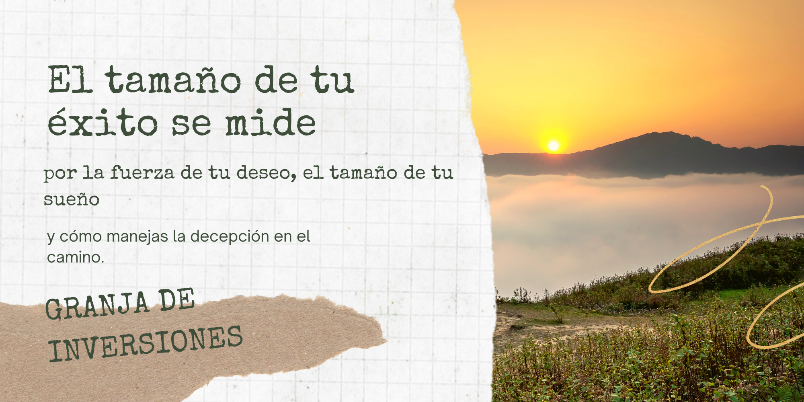

# LOS MALES QUE NOS AFECTAN A TODOS

La crisis a nivel global generada por el COVID-19, que afectó a Colombia de manera particular, ha puesto al descubierto otras problemáticas que el país viene arrastrando desde varios años atrás, y que complejizan aún más la severidad de los estragos actuales y futuros. Por una parte, el nivel de desaprobación histórica que carga el actual gobierno, producto de decisiones polémicas, incumplimientos de promesas, niveles de inseguridad, corrupción por las nubes y desconfianza generalizada en sus instituciones, ha exacerbado el nivel de incertidumbre del país, a dimensiones preocupantes en el contexto regional y mundial.

Otros factores que afectan de manera directa el entorno económico interno, corresponden al incremento sustancial en la tasa de desempleo, que se ubicó en 15,9% en 2020, lo que significa un aumento de 5,4 puntos porcentuales más, frente al 10,5 % de 2019 (@Portafolio2021Desempleo). Adicionalmente las debilidades sustanciales en cuanto a cobertura social y el incremento de la pobreza “… El DANE reveló que la pobreza en el país se incrementó de 35,7% en 2019, a 42,5% en 2020. Casi un 7%. Esto quiere decir que pasamos de 17,5 millones de personas pobres (que no era poco) a 21,02 millones…” (@Rojas2021Concejo).

Pero estas cifras críticas no son culpa exclusiva de la pandemia, la progresiva destrucción de la economía colombiana empezó con la apertura económica proclamada por el entonces Presidente Cesar Gaviria, que mediante un Compes en 1990, abrió las puertas del país a una exposición gradual al mercado global, “… Con el ánimo no solo de mejorar sus relaciones comerciales, sino de incentivar él crecimiento de la industria nacional gracias a la competencia con los demás países y una mejor disponibilidad tanto de bienes como de consumidores…” (@Semana2018Apertura).

Para ese momento la agricultura y la manufactura eran los principales renglones productivos del país, y representaban el 22.3% y el 21.1% del Producto Interno Bruto - PIB, mientras que la banca o sector financiero solo llegaba al 15%. Para 2018 las cifras dieron un vuelco total, al punto que la banca pasó a convertirse en el principal renglón de la economía al aportar el 21.2% del PIB, mientras que la agricultura y la manufactura pasaron a desempeñar papeles secundarios al aportar el 6.3% y el 10.9% respectivamente (@Semana2018Apertura). 

La política neoliberal que desde ese entonces gobierna el país, lanzó a nuestra economía de manera prematura a un río caudaloso (mercado mundial) sin flotador, destacándose la ausencia de una estrategia de producción nacional que incentivara la generación de valor agregado. Al contrario, se enfocó casi que exclusivamente a la lucha armada, que paulatinamente fue perdiendo contra diversas estructuras ilegales, alimentadas por el narcotráfico y que  terminaron permeando las más altas esferas del poder público.      

Como resultado, se tiene un país de vocación rural con una industria agrícola destruida, que se posiciona como el mayor importador de productos alimenticios y agropecuarios de América Latina (@SAC2019Agricultores), en donde el 42.5% de la población total se encuentra en situación de pobreza (@Republica2021millones).   

```{r, out.width= "100%", out.height= "30%", echo=FALSE}

```


