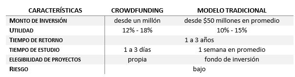

# VENTAJAS Y DESVENTAJAS

La experiencia de la operación del modelo en otros países, ha permitido observar que el riesgo inherente de cada proyecto, es la única posible desventaja, que se mitiga mediante la oferta de mayor rentabilidad, volviéndola atractiva para los inversionistas.

Ahora bien, para identificar las ventajas de la financiación colaborativa es posible tomar como ejemplo las características de inversión en un proyecto del sector inmobiliario:


```{r risk, fig.align='center', out.width='100%', fig.show='hold', echo=FALSE}

```
       
En resumen, las ventajas de la financiación colaborativa, radican inicialmente en la facilidad de acceso, el bajo riesgo, la autonomía inversor para elegir los proyectos, la eliminación de los altos costos de intermediación, mayor utilidad, y el tiempo de estudio de acceso.

<br>
<br>
___GRANJA DE INVERSIONES___ <br>
___Autor___

<br>
<br>

```{r, out.width= "100%", out.height= "30%", echo=FALSE}
knitr::include_graphics("imagenes/Granja1.png")
```

